<p align="center">
  
  
  
  
</p>

<h1 align="center">🧰 PDF Araçları (PDFBox)</h1>

<p align="center">
  <strong>Tarayıcıda çalışan, sunucuya hiçbir dosya göndermeyen, ücretsiz ve açık kaynaklı PDF düzenleme araçları.</strong>
</p>

<p align="center">
  <a href="https://yusufesan.github.io/pdfbox/">
    
  </a>
</p>

---

## ✨ Özellikler

| Araç | Açıklama |
| :--- | :--- |
| 📎 **PDF Birleştirme** | Birden fazla PDF dosyasını tek bir dosyada birleştirin. |
| ✂️ **Sayfa Silme** | PDF dosyanızdan gereksiz sayfaları çıkartın. |
| 💧 **Filigran Ekle** | PDF sayfalarınıza metin tabanlı filigran ekleyin. |
| 🔄 **PDF Döndür** | PDF sayfalarını 90, 180 veya 270 derece döndürün. |
| ✂️ **PDF Böl** | PDF sayfalarını yeni belgelere bölün. |
| 🖼️ **Görselden PDF'e** | Fotoğrafları PDF formatına dönüştürün. |
| 🔒 **PDF Şifreleme** | PDF dosyalarınıza parola koyarak güvenliğini sağlayın. |
| 📷 **PDF'den Görsele** | PDF sayfalarını yüksek kaliteli görsellere dönüştürün. |
| 🔀 **Sayfa Sıralama** | PDF sayfalarının sırasını sürükle-bırak ile değiştirin. |
| 🔢 **Sayfa Numarası** | PDF sayfalarının kenarlarına numara ekleyin. |
| 📝 **Metadata Düzenle** | PDF detaylarını (Başlık, yazar, konu vb.) düzenleyin. |
| 🖼️ **Görselleri Ayıkla** | PDF içindeki gömülü görselleri tek tıkla cihazınıza indirin. |
| 📦 **PDF Sıkıştır** | PDF boyutunu kaliteden fazla ödün vermeden küçültün. |
| 🎙️ **PDF Seslendir** | PDF metinlerini doğal bir sesle dinleyin. |
| 🎨 **Renk Paleti** | PDF belgesindeki baskın renkleri analiz edin. |

---

## 📸 Ekran Görüntüleri

Projede yer alan tüm PDF araçlarının ekran görüntülerine aşağıdan ulaşabilirsiniz:

### 📎 PDF Birleştirme
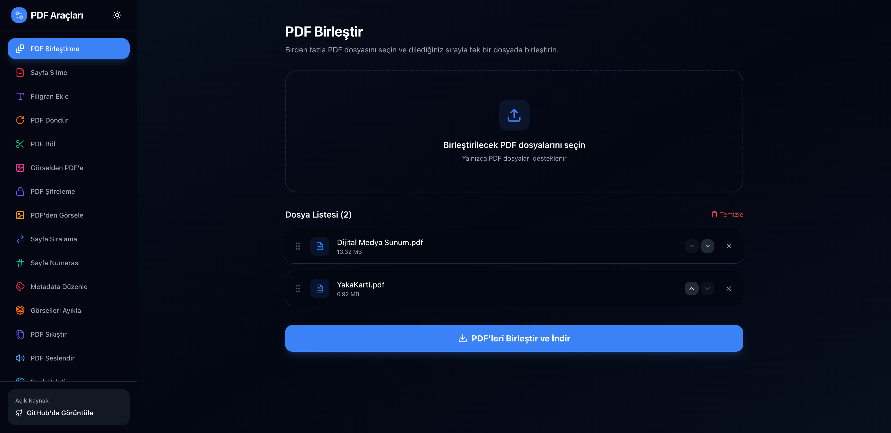

### ✂️ PDF Böl
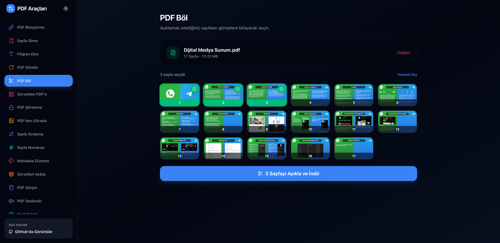

### 🔄 PDF Döndür
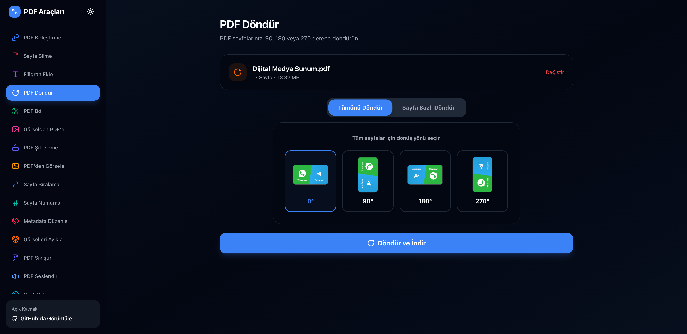
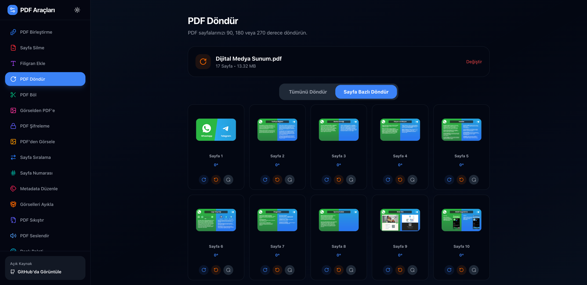

### 💧 Filigran Ekle
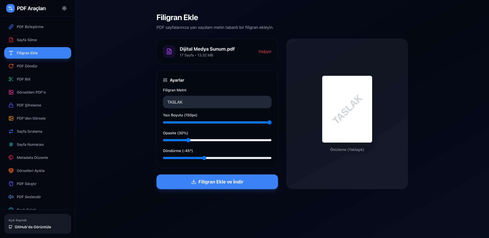

### 🖼️ Görselden PDF'e
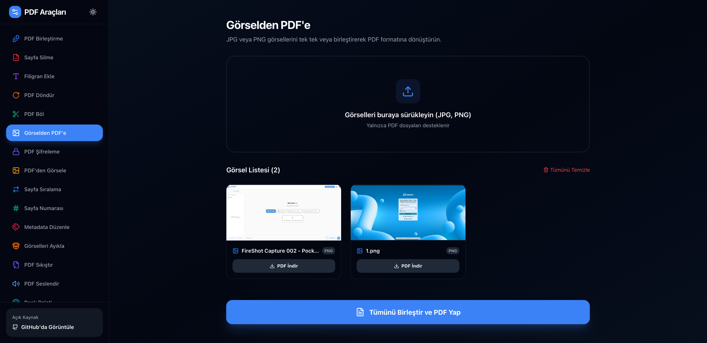

### 📷 PDF'den Görsele
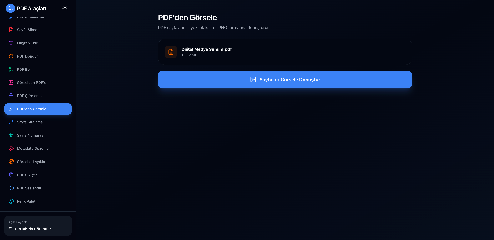

### 🔒 PDF Şifreleme
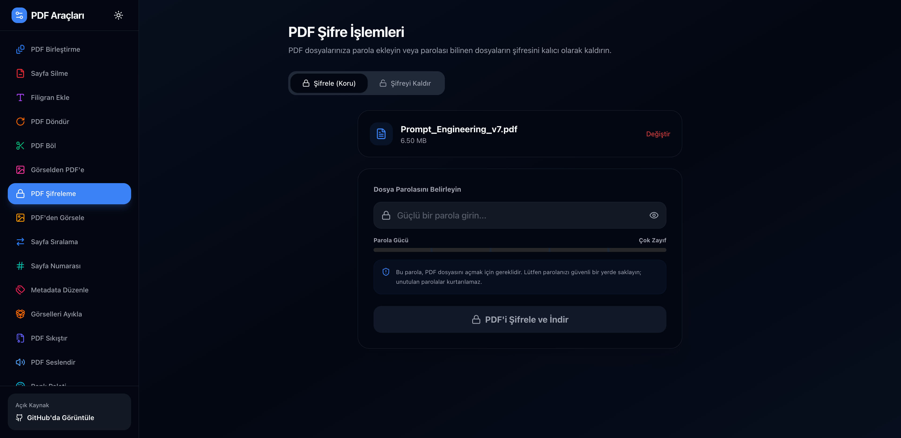

### 🔀 Sayfa Sıralama
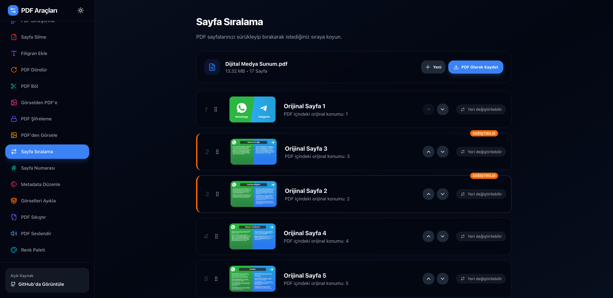

### ✂️ Sayfa Silme
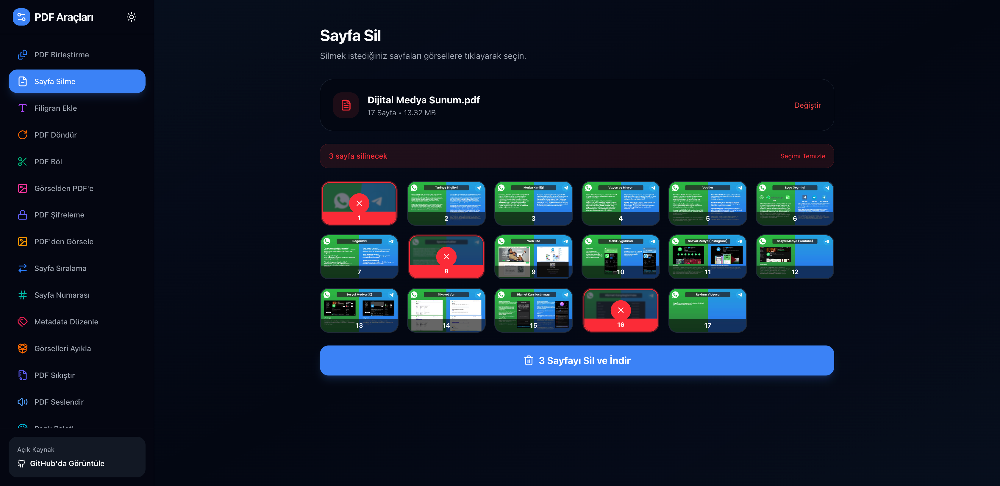

### 🔢 Sayfa Numarası
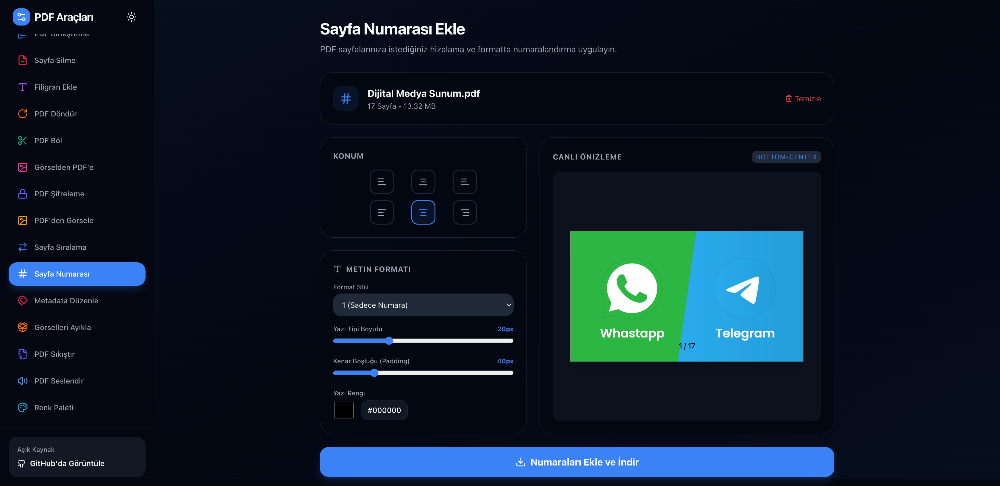

### 🎙️ PDF Seslendir
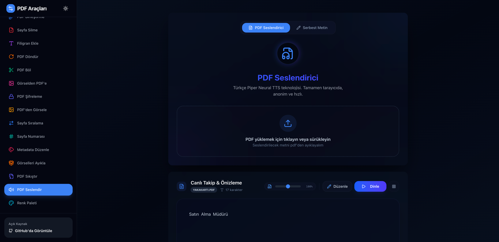

### 📦 PDF Sıkıştır
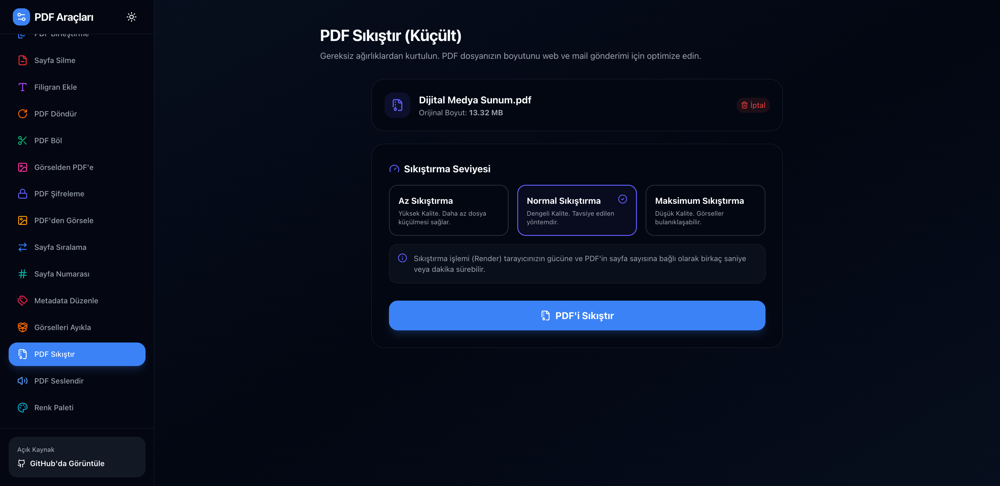
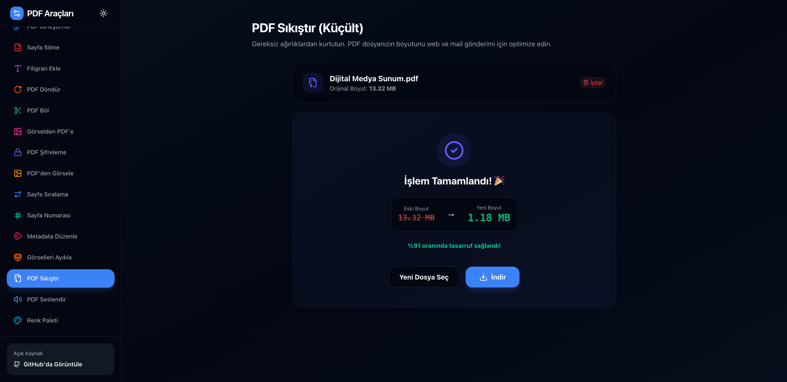

### 📝 Metadata Düzenle
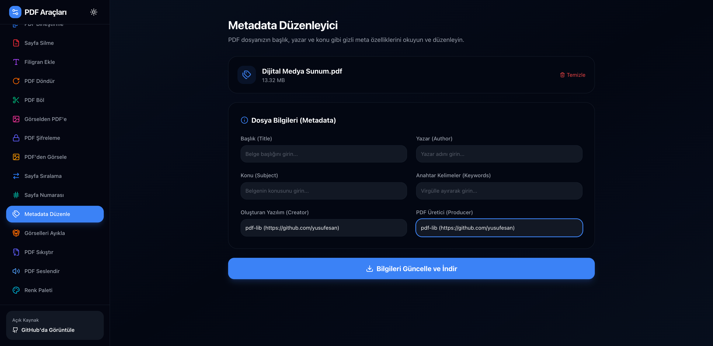

### 🎨 Renk Paleti
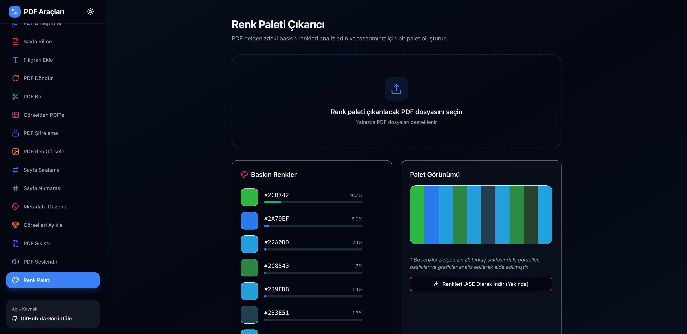

### 🖼️ Görselleri Ayıkla
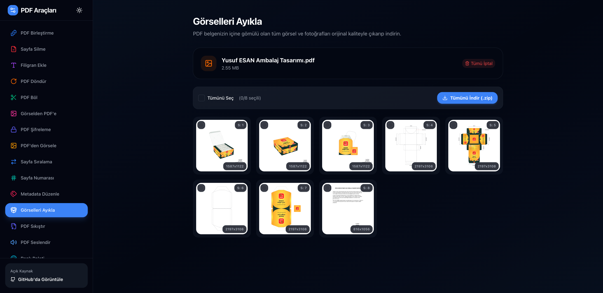

---

## 🔐 Gizlilik Öncelikli

Tüm işlemler **tamamen tarayıcınızda** gerçekleşir.

- ❌ Dosyalar hiçbir sunucuya yüklenmez
- ❌ Üçüncü taraf hizmeti kullanılmaz
- ✅ %100 istemci tarafında işlem
- ✅ Gizliliğiniz garanti altında

---

## 🛠️ Teknolojiler

- **Framework:** [Next.js 16](https://nextjs.org/) (App Router)
- **Dil:** [TypeScript](https://www.typescriptlang.org/)
- **Stil:** [Tailwind CSS 4](https://tailwindcss.com/)
- **PDF İşleme:** [pdf-lib](https://pdf-lib.js.org/) · [pdfjs-dist](https://mozilla.github.io/pdf.js/)
- **Animasyonlar:** [Framer Motion](https://motion.dev/)
- **İkonlar:** [Lucide React](https://lucide.dev/)
- **Dağıtım:** [GitHub Pages](https://pages.github.com/)

---

## 🚀 Yerel Kurulum

```bash
# Depoyu klonlayın
git clone https://github.com/YusufEsan/pdfbox.git
cd pdfbox

# Bağımlılıkları yükleyin
npm install

# Geliştirme sunucusunu başlatın
npm run dev
```

Tarayıcınızda [http://localhost:3000](http://localhost:3000) adresini açın.

---

## 📦 Derleme ve Dağıtım

```bash
# Statik build oluşturun
npm run build

# Build çıktısı `out/` klasöründedir
```

Her `main` dalına yapılan push, **GitHub Actions** aracılığıyla otomatik olarak [GitHub Pages](https://yusufesan.github.io/pdfbox/)'e dağıtılır.

<p align="center">
  <sub>⭐ Beğendiyseniz yıldız vermeyi unutmayın!</sub>
</p>
